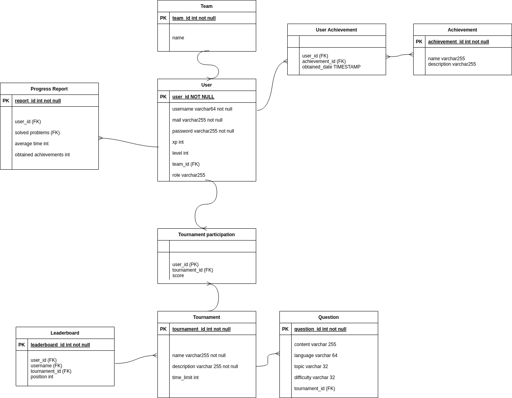

# TMP - Tech Mahindra Project

Este repositorio contiene la implementación y documentación del proyecto de **Tech Mahindra**, basado en una arquitectura modular que integra diferentes capas para proporcionar un servicio robusto y seguro.

## Arquitectura del Proyecto

La arquitectura del proyecto sigue una estructura por capas, separando las responsabilidades en distintas áreas para mejorar la escalabilidad y el mantenimiento.

### Diagrama de Arquitectura

### Descripción de las Capas

1. **Capa de Presentación (Front End)**
   - **Portal Web**: Es la interfaz principal con la que interactúan los usuarios a través de un navegador web. Se encarga de enviar solicitudes al backend mediante el API Gateway.

2. **Capa de Lógica (Backend y Procesamiento)**
   - **API Gateway**: Punto de entrada que gestiona las solicitudes del frontend y las redirige a los servicios adecuados.
   - **Servicio de Backend**: Contiene la lógica de negocio, procesa las solicitudes y se comunica con la base de datos y los servicios de LLM.
   - **Servicios de LLM**: Proveen capacidades de inteligencia artificial mediante modelos de lenguaje (LLM), utilizados para procesamiento avanzado de datos o generación de respuestas inteligentes.

3. **Capa de Datos**
   - **Base de Datos (AWS)**: Almacena información estructurada y no estructurada del sistema, asegurando su disponibilidad y escalabilidad en la nube de AWS.

## Tecnologías Utilizadas (Contempladas hasta ahora)
- **Frontend:** React
- **Backend:** Node.js, Express
- **Base de Datos:** MySQL
- **Infraestructura en AWS:**
  - **API:** AWS Lambda + API Gateway (o EC2)
  - **Base de Datos:** Amazon RDS (MySQL)
  - **Hosting del Frontend:** Amazon S3

## Diagrama ER

El diagrama ER nos ayuda a visualizar de manera clara las relaciones entre las entidades de nuestro proyecto, mostrando cómo interactúan las clases y actores dentro del sistema.

